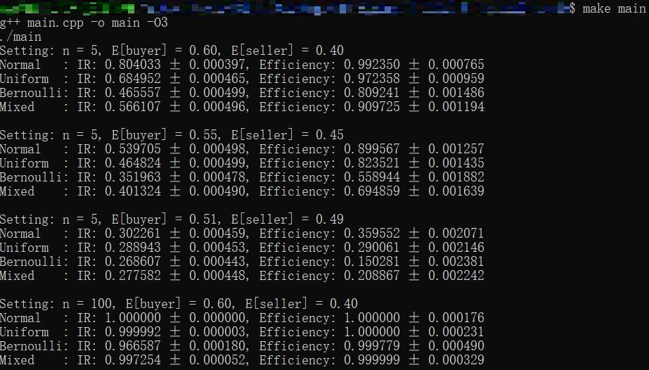

# Non-Excludable Bilateral Trade Between Groups

## Table of Contents

- [General Information](#general-information)
- [Screenshots](#screenshots)
- [File Structure](#file-structure)
- [Reproducing the Experiments](#reproducing-the-experiments)

## General Information

This repository contains the source code for the experiments in the AAAI 2024 paper: Non-Excludable Bilateral Trade Between Groups. We implemented Algorithm 1 and tested its performance under several conditions.

## Screenshots

Part of results in Table 1, produced by the scripts:



## File Structure

The repository contains the following files:
- `main.cpp`: the C++ implementation and testing of Algorithm 1.
- `plot.py`: the python program to plot Figures 1 and 2.

## Reproducing the Experiments

We have written a set of scripts so that the experiments are easily reproduced. Although the source code of algorithms is cross-platform, the scripts use `bash` and `make`, so they only work under Linux-like systems (including Windows Subsystem for Linux).

- To re-run the main experiments, enter

  ``` bash
  make main
  ```

- To generate the figures used in the paper, enter

  ``` bash
  make plot
  ```

  